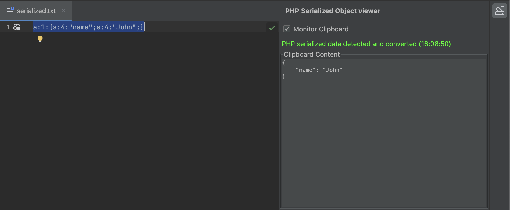
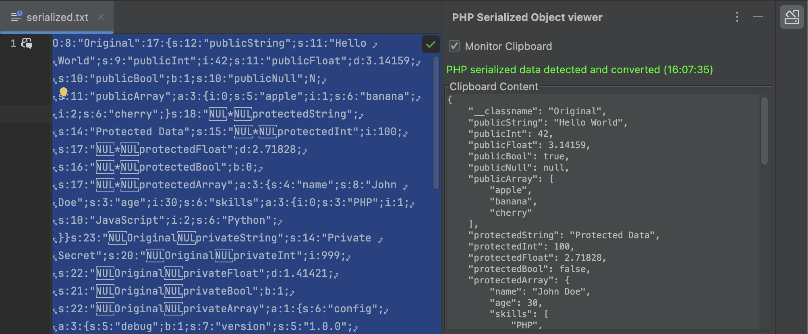

# PHP Serialized Object Viewer

A plugin that monitors clipboard and converts PHP serialized strings to JSON format for display.

## Features

- **Clipboard monitoring**: Monitor clipboard content every 1 second
- **Automatic detection & conversion**: Automatically convert to JSON format when PHP serialized data is detected
- **Tool window display**: Display conversion results in a dedicated tool window

## Quick Example

**PHP Serialized Data:**
```
a:2:{s:4:"name";s:4:"John";s:3:"age";i:30;}
```

**Converted to JSON:**
```json
{
    "name": "John",
    "age": 30
}
```






## Supported PHP Serialization Formats

For detailed information about supported PHP serialization formats, see the conversion library documentation:
[php-json-deserializer-kt](https://github.com/haradakunihiko/php-json-deserializer-kt)

## Installation

### Method 1: Install from Plugin File

1. **Build the plugin**:
   ```bash
   ./gradlew buildPlugin
   ```

2. **Open IntelliJ IDEA/DataGrip**

3. **Open plugin settings**:
   - `File` → `Settings` (Windows/Linux)
   - `IntelliJ IDEA` → `Preferences` (macOS)

4. **Install the plugin**:
   - Select `Plugins` from the left menu
   - ⚙️ (gear icon) → `Install Plugin from Disk...`
   - Select `build/distributions/intellij-plugin-php-serialized-object-viewer-1.0.1.zip`
   - Click `OK`

5. **Restart IDE**

## Usage

### Using Clipboard Monitoring Feature

1. **Open tool window**:
   - `View` → `Tool Windows` → `PHP Serialized Object Viewer`
   - Or click `PHP Serialized Object Viewer` from the tool window bar on the right

2. **Copy PHP serialized data**:
   - Copy PHP serialized data from DataGrip cells
   - Or copy PHP serialized data to clipboard from any source

3. **Check automatic conversion**:
   - Check automatically converted JSON results in the tool window
   - Check conversion success/failure in status messages


## Supported Versions

- **IntelliJ IDEA**: 2023.2 or later
- **DataGrip**: 2023.2 or later
- **Java**: 17 or later

## Technical Specifications

- **Language**: Kotlin
- **Framework**: IntelliJ Platform Plugin SDK
- **Dependencies**: `io.github.haradakunihiko:php-json-deserializer-kt`
- **Build Tool**: Gradle

## Developer Information

### Development Environment Setup

1. **Install Java 17 or later**
2. **Clone the project**
3. **Download dependencies**:
   ```bash
   ./gradlew build
   ```

### Frequently Used Commands

#### Build Related
```bash
# Clean build project
./gradlew clean build

# Build plugin (create distribution zip file)
./gradlew buildPlugin

# Compile only
./gradlew compileJava

# Force update dependencies and build
./gradlew clean --refresh-dependencies build
```

#### Development & Debug
```bash
# Run plugin in IDE (debug mode)
./gradlew runIde

# Run tests
./gradlew test

# Verify plugin
./gradlew verifyPlugin
```

#### Dependency Management
```bash
# List dependencies
./gradlew dependencies

# Force update dependencies
./gradlew --refresh-dependencies compileJava
```

### Dependency Update Process

After changing versions in build.gradle.kts:

1. **Clean build**:
   ```bash
   ./gradlew clean
   ```

2. **Update dependencies and compile**:
   ```bash
   ./gradlew --refresh-dependencies compileJava
   ```

3. **Test functionality**:
   ```bash
   ./gradlew runIde
